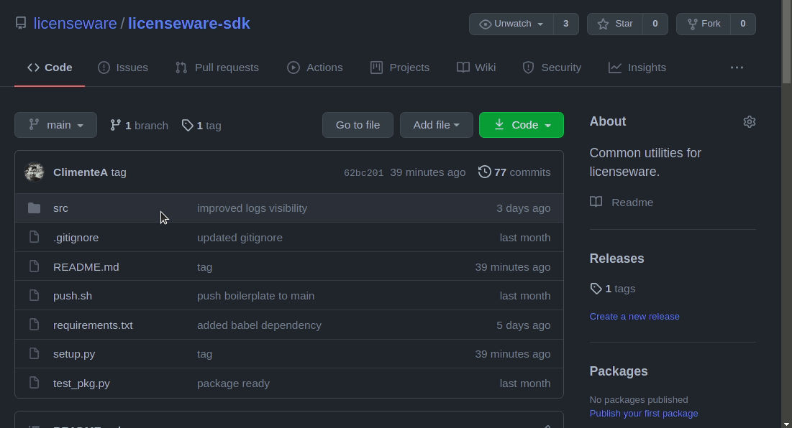

# Licenseware SDK

Common utilities for Licenseware.


## Quickstart

Install latest update for this package using the following pip command:
```bash

pip3 install git+https://git@github.com/licenseware/licenseware-sdk.git

```

Install from a specific branch

```bash

pip3 install git+https://git@github.com/licenseware/licenseware-sdk.git@branch_name

```

Install from a specific tag

```bash

pip3 install git+https://git@github.com/licenseware/licenseware-sdk.git@tag_name

```

You can use `git+ssh` if you have ssh keys configured. 
Uninstall with `pip3 uninstall licenseware`.

To see documentation of the package run:
```bash

python3 -m pydoc -p 0 -b

```

It will start a localhost server with the documentation.


## How to create a release

- In `setup.py` update the package version; 
- Create a tag with that version ex: `git tag -a v0.0.11`;
- You can list available tags with `git tag -n`;
- Push created tag with `git push --tags`

Now you use pip to install it from that specific tag:

```bash

pip3 install git+https://git@github.com/licenseware/licenseware-sdk.git@v0.0.11

```

If you want to add more details regarding this package release you can `Create a new release`

- Click the link `Releases`;
- Click `Draft a new release`;
- Click `Tags`;
- Select latest tag version name;
- Add title and description for the release;



Optionally you can create a wheel for this package:
```bash

python3 setup.py bdist_wheel sdist

```

And add it to binaries on the release.
